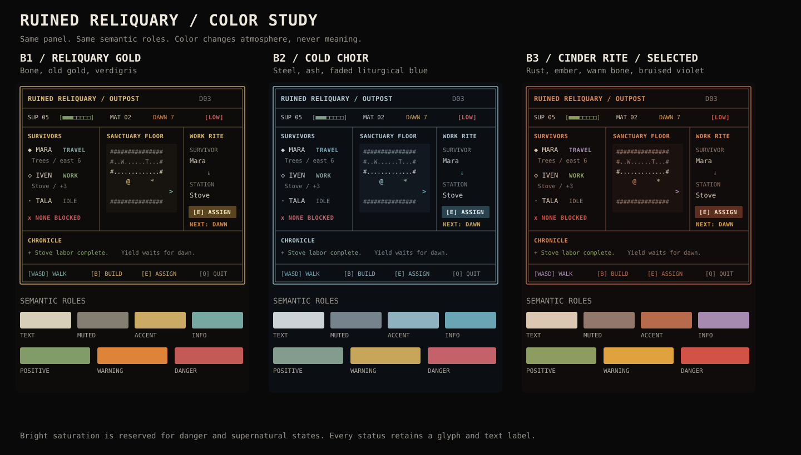

# Foundation TUI Style Mockups

**Status:** owner-approved UI acceptance target: direction B / palette B3
(Cinder Rite). Production implementation remains a separate task.

These sketches explore a reusable visual language for the current Foundation
colony screen. They use only information already present in the game or already
required by the Foundation UI plan. Numbers and names are illustrative.

Each full-size canvas is exactly 80 columns and fits within 24 rows. The compact
canvas is exactly 60 columns and fits within 20 rows; unused rows are deliberate
headroom for terminal/runtime variation.

## Non-negotiable rules

- The shelter map remains the primary visual surface.
- Decoration never carries meaning by itself. Every warning, state, and action
  also has a text label or stable symbol.
- Borders, gauges, chips, and ribbons come from shared primitives. Screens
  compose them; they do not invent local variants.
- All semantic glyphs remain owned by the visual registry and all colors remain
  owned by the theme registry.
- The style must remain legible without color and survive the 60x20 profile.
- Use single-cell terminal glyphs only. Provide plain-ASCII fallbacks for any
  optional Unicode ornament.

## Shared widget vocabulary

| Primitive | Purpose | Example |
|---|---|---|
| `ModeRibbon` | Screen, day, turn, and next boundary | `OUTPOST / DAY 03 / DAWN IN 7` |
| `MetricChip` | Compact value with explicit state | `[SUP 05]`, `[MAT 02]`, `[LOW]` |
| `ResourceGauge` | Quantity, capacity, or time pressure | `SUP 05 [#####---]` |
| `PanelFrame` | Consistent titled container | `+- SURVIVORS --------+` |
| `StatusChip` | Worker or system state | `[WORK]`, `[TRAVEL]`, `[BLOCKED]` |
| `ProgressTrack` | Work, travel, build, or production | `Stove [###-] 3/4` |
| `StepTrack` | Multi-step tasks and wizards | `SURVIVOR > STATION > CONFIRM` |
| `ContextCard` | Selected entity and valid actions | target, distance, cargo, controls |
| `ResultRibbon` | Most recent resolved consequence | `RESULT +3 Supplies / Stove` |
| `CommandRibbon` | Only relevant controls | `[B] Build  [E] Assign  [N] Rest` |
| `MiniLegend` | Visible symbols only | `@ You  * Worker  + Site  > Target` |

The Rust implementation would back these with a small set of shared Ratatui
composites (`Block`, `Table`, `List`, `Gauge`, and styled `Line`/`Span` builders),
not a bespoke widget for each screen.

## Direction A — Sacred Ledger

Restrained dividers, strong labels, and compact instrument-like widgets. The
atmosphere comes from cadence and framing rather than dense ornament.

```text
┌─ OUTPOST / DAY 03 ────────────────────────┬─ STORES ─────────────────────────┐
│ DAWN IN 7  [#####--]   TURN 041           │ SUP 05 [###-----]  MAT 02 [#---] │
├─ SURVIVORS ───────────┬─ SHELTER MAP ─────┴───────────┬─ SELECTED ───────────┤
│ MARA  [TRAVEL]        │###############################│ MARA / Scavenger     │
│ Trees · east · 6      │#...........+.................#│ Task    Gather Wood  │
│ Cargo  --  [##----]   │#..W.................T........#│ Target  Trees / E 6  │
│                       │#.............................>#│ Cargo   empty       │
│ IVEN  [WORK]          │#........#####................#│ Progress [##----]    │
│ Stove · Supplies      │#........#...#......*.........#├─ NEXT ───────────────┤
│ Output +3  [###-]     │#....@...#...#................#│ Worker  Iven / 1 turn│
│                       │#........##+##................#│ Dawn    Supplies -3  │
│ TALA  [IDLE]          │#.............................#│ Net     05 -> 05     │
│ Near player           │###############################├─ ACTIONS ────────────┤
│ Ready  [------]       │ @ You  * Worker  + Site  > Goal│ [E] Assign          │
├─ WORK QUEUE ──────────┴────────────────────────────────┤ [B] Build           │
│ 1  Stove       [COMPLETE]  produces at dawn            │ [N] Rest            │
│ 2  Workbench   [BUILD]     [###-] 3/4                  │ [T] Travel          │
├─ RESULT ────────────────────────────────────────────────┴────────────────────┤
│ + Iven completed Stove work. Next dawn: +3 Supplies.                         │
├──────────────────────────────────────────────────────────────────────────────┤
│ [WASD] Move   [E] Interact   [F5] Save   [F9] Load   [Q] Quit                │
└──────────────────────────────────────────────────────────────────────────────┘
```

Why it works:

- Worker state, target, distance, cargo, and progress scan vertically.
- The map stays dominant while the selected card prevents duplicated detail.
- `RESULT` separates a completed event from forecasts in `NEXT`.
- The same frame, chip, gauge, context, result, and command primitives work in
  dungeon, travel, inventory, and outcome screens.

## Direction B — Ruined Reliquary (selected)

More atmospheric and ceremonial. Double rules and broken divider marks create
a grim sacred-machine character, while the inner data remains plain.

```text
╔═ OUTPOST ═ DAY 03 ════════════════════════════════════ DAWN IN 7 ════════════╗
║ SUPPLIES 05  [■■■□□□□□]     MATERIALS 02  [■□□□]     STATE: PRECARIOUS       ║
╠═ SURVIVORS ═══════════╦═ SANCTUARY FLOOR ═══════════════╦═ WORK RITE ════════╣
║ ◆ MARA   TRAVEL       ║############################### ║ SURVIVOR            ║
║   Trees / east 6      ║#...........+.................# ║   Mara              ║
║   cargo --  ╶──╴      ║#..W.................T........# ║        │            ║
║                       ║#............................># ║        ▼            ║
║ ◇ IVEN   WORK         ║#........#####................# ║ STATION             ║
║   Stove / Supplies    ║#........#...#......*.........# ║   Stove             ║
║   output +3  ╶━━╴     ║#....@...#...#................# ║        │            ║
║                       ║#........##+##................# ║        ▼            ║
║ · TALA   IDLE         ║#.............................# ║ CONFIRM             ║
║   near player         ║############################### ║ [E] Bind worker     ║
║                       ║ @ pilgrim  * worker  > calling ╠═ OMEN ══════════════╣
╠═ LABORS ══════════════╩═════════════════════════════════╣ Dawn: 05 -> 05     ║
║ Stove      COMPLETE   ╶━━━━━━━━╴    Workbench  3/4      ║ No loss forecast   ║
╠═ CHRONICLE ═════════════════════════════════════════════╩════════════════════╣
║ Iven completed the Stove's labor. Its yield waits for dawn.                  ║
╠══════════════════════════════════════════════════════════════════════════════╣
║ [WASD] WALK   [B] BUILD   [E] ASSIGN   [N] END DAY   [Q] QUIT                ║
╚══════════════════════════════════════════════════════════════════════════════╝
```

This direction has the strongest identity, but double borders and ornament
consume visual weight. Use double rules for outer frames and major boundaries;
use muted single rules inside dense data panels.

### Direction B color study



The three treatments apply different palettes to the same semantic roles:

| Treatment | Neutral foundation | Ceremonial accent | State colors | Character |
|---|---|---|---|---|
| **B1 Reliquary Gold** | charred black + bone | old gold + verdigris | moss / ember / dried blood | sacred, aged, readable |
| **B2 Cold Choir** | blue-black + pale steel | faded liturgical blue | sage / amber / cold red | severe, orderly, distant |
| **B3 Cinder Rite — selected** | soot + warm bone | oxidized copper + bruised violet | lichen / flame / hot red | dramatic, unstable, oppressive |

**Owner selection: B3 Cinder Rite.** Oxidized copper carries the sacred-machine
frame, warm bone keeps routine data readable, and bruised violet carries
information and navigation. Flame-gold remains distinct from copper for
warnings, while danger keeps exclusive ownership of red.

Selected exact palette:

| Semantic role | Intended color | Hex | Portable ANSI fallback |
|---|---|---|---|
| Canvas | Soot | `#100c0b` | terminal default |
| Inset surface | Burned umber | `#1b120f` | terminal default |
| `UiText` | Warm bone | `#dcc7b3` | `White` |
| `UiMuted` | Clay ash | `#92786b` | `DarkGray` |
| `UiPanelBorder` | Deep rust | `#714737` | `DarkGray` |
| `UiPanelTitle` / major title | Lit copper | `#dd8a50` | `LightYellow` |
| `UiAccent` | Oxidized copper | `#b76b4c` | `Yellow` |
| `UiModalBorder` / primary frame | Oxidized copper | `#b76b4c` | `Yellow` |
| `UiModalTitle` / major title | Lit copper | `#dd8a50` | `LightYellow` |
| `UiInfo` / navigation | Bruised violet | `#a68ab0` | `LightMagenta` |
| `UiKeyHint` | Bruised violet | `#a68ab0` | `LightMagenta` |
| `UiPositive` | Lichen | `#8d9d62` | `Green` |
| `UiWarning` | Flame-gold | `#e0a13f` | `LightYellow` |
| `UiDanger` | Hot blood | `#d15348` | `LightRed` |
| Selection | Pale ember on oxblood | `#ffe1c6` on `#5b2e20` | `Black` on `Yellow` |

As an accessibility heuristic, every B3 semantic foreground above maintains at
least 4.67:1 contrast against the soot canvas. Deep rust is used for decorative
rules, not text.

Color discipline for Direction B:

- Use warm bone for ordinary information; most text should not be copper.
- Use deep rust for inner rules. Reserve lit copper for titles, active focus,
  and major modal frames.
- Use bruised violet for information, navigation, and later supernatural hints;
  never use it as an ordinary warning.
- Do not use red for atmosphere. Red always means damage, denial, blocking, or
  immediate danger. Flame-gold owns warnings.
- Use selection backgrounds sparingly. Persistent panels keep the terminal's
  base background so the screen does not become a mosaic of dark rectangles.
- Keep map entities on their own semantic tokens. Colony, dungeon, and travel
  chrome may share the palette without recoloring enemies, loot, exits, or the
  player by screen.
- Preserve the glyph, label, and modifier channels demonstrated in the
  monochrome mockup. Color reinforces state; it never defines state alone.

The current renderer accepts the 16 named ANSI colors in the fallback column.
Exact hex colors would require a separately approved truecolor theme extension;
until then, the player's terminal palette controls the precise hue.

## Direction C — Expedition Board

The densest and most operational option. Tables, short labels, and explicit
columns make colony optimization fast, with less atmosphere.

```text
+ OUTPOST  DAY 03  TURN 041 -------------------+ STOCK / FLOW -----------------+
| DAWN 7 [#####--]  SUP 05  MAT 02             | SUP 05  -3/day  +3 next  = 0  |
+ WORKERS -------------------------------------+ MAT 02   0/day   0 next  = 0  |
| NAME  STATE   TASK       TARGET    CARGO PROG| BLOCKED 0   SITES 1   IDLE 1  |
| Mara  TRAVEL  Gather     Trees E6  --    2/6 |-------------------------------|
| Iven  WORK    Supplies   Stove     --    3/4 | SELECTED: Mara                |
| Tala  IDLE    --         Near @    --    --  | Target  Trees / east / 6      |
+ MAP -----------------------------------------+ Cargo   empty                 |
|############################################# | ETA     4 turns               |
|#..W.................T......................# | [E] Reassign                  |
|#......................#####...............># | [B] Build nearby              |
|#.........@............#...#......*.........# |-------------------------------|
|#......................##+##................# | QUEUE                         |
|#...........................................# | 1 Stove       DONE  [####]    |
|############################################# | 2 Workbench   BUILD [###-]    |
| @ YOU  * WORKER  + SITE  > OFFSCREEN TARGET | 3 --                           |
+ RESULT ----------------------------------------------------------------------+
| OK  Iven finished work / Stove / +3 Supplies pending next dawn               |
+------------------------------------------------------------------------------+
| WASD Move | E Assign | B Build | N Rest | T Travel | F5 Save | Q Quit        |
+------------------------------------------------------------------------------+
```

Tradeoff: excellent for high-information colony play and narrow text fixtures,
but it risks feeling like a debug console unless contained inside Direction B's
typography, spacing, and outer frame.

## Selected synthesis

Use **Direction B as the global grammar**, then borrow selectively:

- Direction B's double outer rule for primary frames, outcomes, and major
  modal moments;
- Direction C's aligned worker/economy tables when comparison matters;
- muted single-line inner panels where data density requires restraint;
- ornament only in headings and transitions, never inside dense data rows.

This yields a recognizable Broken Divinity shell without sacrificing colony
readability or creating a second widget system.

## Compact proof — 60x20

The selected grammar collapses secondary lists before shrinking the map.
Selected detail replaces the full worker list; essential stores remain visible.

```text
┌─ OUTPOST / D03 ───────────────────┬─ STORES ─────────────┐
│ DAWN 7 [#####--]                  │ SUP 05  MAT 02       │
├─ SHELTER MAP ─────────────────────┴──────────────────────┤
│###############################   MARA [TRAVEL]           │
│#..W.................T........#   Trees / east / 6        │
│#............................>#   cargo --  [##----]      │
│#........#####................#                           │
│#........#...#......*.........#   NEXT                    │
│#....@...#...#................#   Iven / 1 turn           │
│#........##+##................#   Dawn 05 -> 05           │
│###############################                           │
│ @ You  * Worker  + Site  > Goal   [E] Assign             │
├─ QUEUE ────────────────────────────┬─────────────────────┤
│ Stove [DONE]  Workbench [###-] 3/4│ [B] Build [N] Rest   │
├─ RESULT ────────────────────────────┴────────────────────┤
│ + Stove work complete; +3 Supplies waits for dawn.       │
├──────────────────────────────────────────────────────────┤
│ WASD Move  E Act  F5 Save  F9 Load  Q Quit               │
└──────────────────────────────────────────────────────────┘
```

## Recorded decision and remaining choices

Recorded on 2026-08-01:

- **Visual grammar:** B — Ruined Reliquary.
- **Color treatment:** B3 — Cinder Rite.
- **Data comparison:** borrow Direction C tables without adopting its chrome.

Before renderer work begins, confirm whether the exact truecolor palette should
be implemented with named ANSI fallbacks, and whether optional Unicode fills
(`■□`, `━━`) are acceptable. The plain-ASCII compatibility form is
`[####----]` and remains the canonical fallback.
